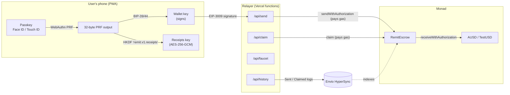
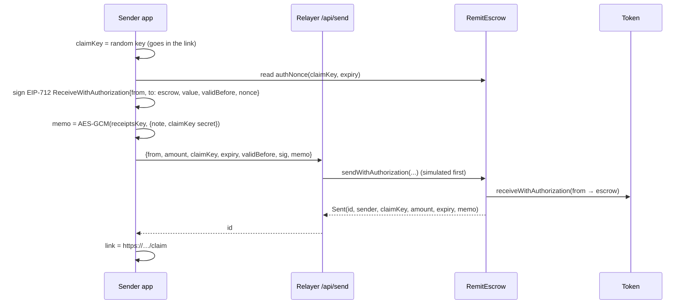

# Remit architecture

Remit has three parts:

1. **An escrow contract on Monad**, which holds each link's dollars.
2. **A thin relayer**, a set of Next.js API routes that pays gas.
3. **An installable web app**, where every key is derived from the user's passkey.

The relayer is trusted to stay online. It is never trusted with funds or with deciding where money goes.



## 1. Accounts: one passkey, many keys

Remit has no accounts table, no passwords and no stored keys. Everything comes from one WebAuthn PRF evaluation, done with [Mera](https://mera.category.xyz).

```
passkey ──PRF(salt = sha256("mera.prf.salt.v1"))──► prfOutput (32 bytes)
   ├─ BIP-39 entropy → seed → m/44'/60'/0'/0/0 → secp256k1 key → EVM address   (Mera)
   └─ HKDF-SHA256(info = "remit.v1.receipts") → AES-256-GCM key (non-extractable)  (Remit)
```

- **One prompt gives both keys.** Signing in runs a single Face ID or Touch ID prompt, and both keys are derived from it.
- **Same keys on every device.** The PRF output depends only on the passkey, the domain and the salt. A passkey synced through iCloud Keychain or Google Password Manager reproduces the same address and receipts key on any device.
- **Separate keys.** The HKDF label keeps the receipts key independent of the wallet key. A leaked receipts key reveals nothing about the wallet.
- **Keys only exist in memory.** The wallet key lives inside a Mera signing session, and the receipts key is a non-extractable `CryptoKey`. Neither is written to storage.
- **Phone-first passkey prompts.** Mera doesn't expose WebAuthn hints, so `lib/wallet.ts` adds `hints: ["client-device"]`, and `authenticatorAttachment: "platform"` on creation, around Mera's calls. The browser then offers Face ID or Touch ID before "scan a QR code" or "use a security key".

## 2. Contracts

### `RemitEscrow.sol`

| Function | Who calls it | What it does |
|---|---|---|
| `send(amount, claimKey, expiry, memo)` | Sender, paying their own gas | Pulls tokens through `transferFrom` and opens a link. Kept for wallets that hold gas. |
| `sendWithAuthorization(from, amount, claimKey, expiry, validBefore, v, r, s, memo)` | Relayer | Gasless send. Pulls tokens with EIP-3009 `receiveWithAuthorization`. |
| `claim(id, to, sig)` | Relayer (anyone) | Pays a link out to `to` if `sig` is the claim key's signature over `(chainId, escrow, id, to)`. |
| `refund(id)` | Original sender, after `expiry` | Returns an unclaimed link's money to the sender. |

Each link stores `{ sender, claimKey, amount, expiry }` in one storage slot pair, and is deleted when claimed or refunded.

**Why the relayer can't steal money:**

- **Sends.** The token signature's `nonce` is `keccak256(escrow, claimKey, expiry)`. If a relayer submits a different claim key or expiry, the escrow computes a different nonce and the token rejects the signature. Amount, sender and recipient (the escrow) are covered by the EIP-712 message itself. Tests cover a swapped key, a changed amount and a replay.
- **Claims.** The link's one-time private key signs the recipient's address. A relayer, or anyone watching the mempool, who replaces `to` with their own address invalidates the signature. That makes the claim safe from front-running even though the claim key is effectively public once the link has been used.
- **Direct token calls.** EIP-3009 `receiveWithAuthorization` requires `msg.sender == to`, so only the escrow can redeem the authorization.

**Memo.** Each send stores up to 512 bytes of encrypted receipt in the `Sent` event. It's carried on the event, not in storage, so it costs little gas. The memo isn't covered by the sender's signature, so a malicious relayer could swap it, but AES-GCM authentication fails and the app shows the entry without a note. The worst-case receipt is 414 bytes: a 100-character note made of 3-byte characters.

### `TestUSD.sol`

A testnet stand-in for AUSD: 6 decimals, open `mint`, and the same EIP-3009 `receiveWithAuthorization` that mainnet AUSD exposes. We checked mainnet AUSD (`0x00000000eFE302BEAA2b3e6e1b18d08D69a9012a`) on-chain. Its EIP-712 domain is `"Agora Dollar"` version `"1"`, and its implementation contains `receiveWithAuthorization`. The app reads `name()` from the token to build the signing domain, so the same code works on mainnet.

## 3. Flows

### Send (one signature, no gas)



The secret is in the URL fragment (`#…`). Browsers never send fragments to servers, so neither Vercel's logs nor our API ever see it.

### Claim (gasless for a brand-new user)

1. The recipient opens the link. The app reads `links(id)` and shows the amount.
2. They create a passkey, and Mera derives their new address.
3. The app asks the escrow for `claimDigest(id, to)`, then signs it with the claim key taken from the URL fragment.
4. `/api/claim` validates the input, simulates the call and submits `claim(id, to, sig)`. The relayer pays the gas.

### History (Envio HyperSync)

Monad's public RPC rejects `eth_getLogs` ranges above about 100 blocks, which is under a minute at Monad's block time. `/api/history?addr=` uses **Envio HyperSync** instead:

1. One paginated query, from `ESCROW_FROM_BLOCK` to the chain head, fetches `Sent` events where `sender == addr` and `Claimed` events where `to == addr`. It also joins block timestamps.
2. A second query fetches the `Sent` events for the claimed link IDs, which hold the amounts received.
3. The client decrypts each `Sent.memo` with the receipts key, and reads `links(id)` to label each item "Waiting" or "Claimed". Unclaimed links show **Copy link**, rebuilt from the decrypted claim secret.

## 4. Relayer

`lib/relayer.ts` holds one server-only key (`RELAYER_PRIVATE_KEY`). Every route follows the same steps:

1. **Validate the input.** Check addresses, integer strings, signature lengths and the memo size cap.
2. **Simulate the call** with `simulateContract`, so reverts come back as readable errors and never cost gas.
3. **Submit it and wait for the receipt.**

| Route | Purpose |
|---|---|
| `POST /api/send` | Gasless send |
| `POST /api/claim` | Gasless claim |
| `POST /api/faucet` | Testnet only. Tops an account up to $100 of TestUSD, and only if its balance is under $50. |
| `GET /api/history` | HyperSync-backed transaction list |

**Known limits:**

- **Nonce collisions.** viem fetches the nonce for every call, so heavy concurrent traffic could collide. The fix is a nonce queue or a pool of relayer keys.
- **No rate limiting yet.** That's acceptable on testnet. Mainnet needs per-account quotas, or a small fee taken in AUSD.
- **Refunds aren't relayed yet.** The contract supports refunds, but the sender currently pays the gas.

## 5. Front end

- **Framework:** Next.js 16 App Router on Vercel, using viem for chain reads and typed-data signing.
- **Installable app:** `app/manifest.ts` sets standalone display, `app/icon.tsx` and `app/apple-icon.tsx` generate the icons, and the viewport covers the notch with safe-area padding. Installed to the home screen, it opens full-screen like a native app.
- **Screens:** the wallet home (balance, Send / Receive / Add, transactions), bottom sheets for each action, and the claim page.
- **Configuration:** contract addresses and the RPC URL are public (`NEXT_PUBLIC_*`). The relayer key and the Envio token are server-only.

## 6. Monad specifics we ran into

- **RPC timeouts.** `testnet-rpc.monad.xyz` timed out under deploy load, so we use `rpc-testnet.monadinfra.com`. It's set through `NEXT_PUBLIC_RPC`.
- **Fresh balances can lag.** A transaction sent right after funding an account occasionally failed with "insufficient balance", even though the balance showed up moments later. Our guess is that execution trails consensus slightly. Users never hold MON, so this only affected our test scripts, which now wait for the balance.
- **`eth_getLogs` is capped at about 100 blocks.** That's why history uses HyperSync.

## 7. Testing

| Check | What it covers |
|---|---|
| `forge test` (9 tests) | Claims, front-run redirection, refund timing, memo size cap, relayer-submitted sends, swapped claim key, changed amount, replay, and that only the escrow can redeem an authorization. |
| `node scripts/receipts.check.ts` | Receipt encryption round-trip. Covers the same passkey on another device, a different passkey failing, tamper detection, and the size cap. |
| `node --env-file=.env.local scripts/smoke.mjs <url>` | Full end-to-end run on testnet through a deployed relayer. Neither party holds MON. |
